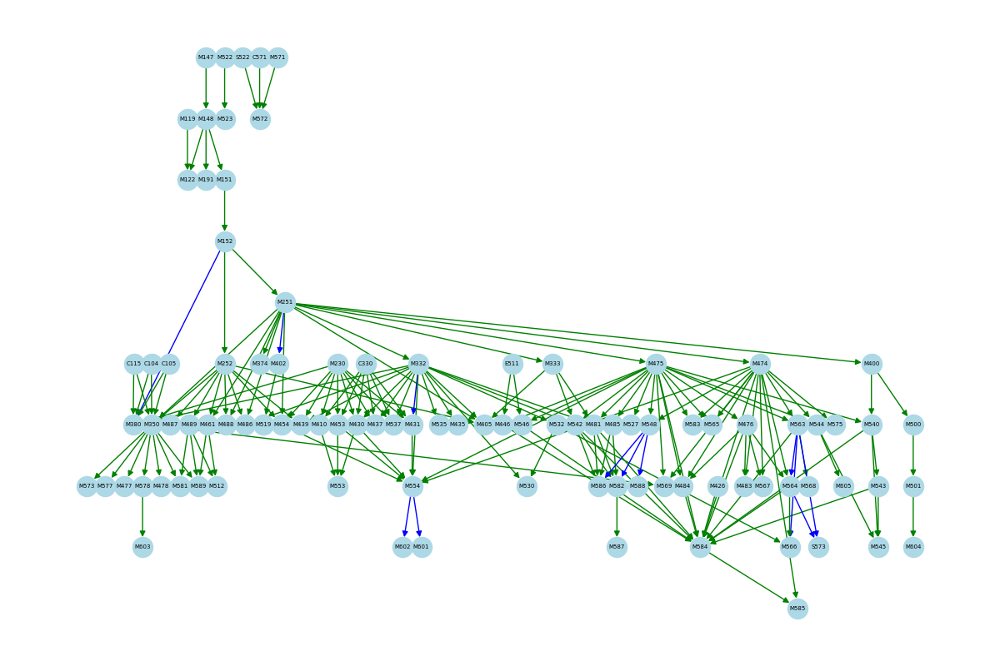

# 📘 IIT Course Graphs

This project provides an interactive graph-based visualization of Illinois Tech's course prerequisites using a Streamlit web app. It scrapes course data directly from the [IIT MATH course catalog](https://catalog.iit.edu/courses/math/) and builds a dynamic dependency graph, enabling users to explore prerequisites and corequisites for MATH courses.

---

## 🚀 Features

- Interactive web UI built with **Streamlit**
- Select courses you plan to take, and automatically see all required prerequisites
- Toggle display of **corequisites** and filter by individual courses
- Clean and organized layout using **Graphviz** and **NetworkX**
- Dynamically updating graphs with hover and zoom support (via PyVis or matplotlib)

---

## 🛠 Setup

Make sure you have Python 3.8+ installed. Then:

```bash
git clone https://github.com/igoeldc/iit_course_graphs.git
cd iit_course_graphs
pip install -r requirements.txt
```

If you use `pygraphviz`, you may need:

```bash
brew install graphviz
pip install pygraphviz
```

---

## ▶️ Usage

Launch the Streamlit app:

```bash
streamlit run app.py
```

Select courses from the dropdown and explore the prerequisite graph!

---

## 🧠 How it Works

- Scrapes [IIT's math course catalog](https://catalog.iit.edu/courses/math/) using **BeautifulSoup**
- Parses course blocks and extracts prerequisites and corequisites from HTML
- Builds a directed graph using **NetworkX**
- Displays the graph interactively using **matplotlib** or **PyVis**

---

## 📂 Project Structure

```
.
├── app.py                  # Main Streamlit application
├── scrape.py               # Web scraper to extract course and prereq info
├── graph_utils.py          # Graph construction and visualization helpers
├── requirements.txt
└── README.md
```


## 🖼 Example




<!-- ---

## 📄 License

MIT License. See `LICENSE` for details. -->
